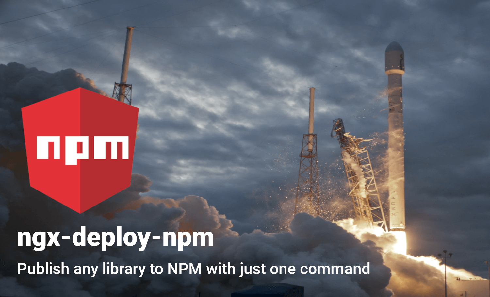

# ngx-deploy-npm 🚀 <!-- omit in toc -->

[![NPM version][npm-image]][npm-url]
[![NPM donwoads][downloads-image]][npm-url]
[![The MIT License][mit-licence-image]][mit-licence-url]
[![Conventional Commits][conventional-commits-image]][conventional-commits-url]

[![Reliability Rating][sonar-reliability-image]][sonar-link]
[![Security Rating][sonar-security-image]][sonar-link]
[![Maintainability Rating][sonar-maintainability-image]][sonar-link]

![Linux][linux-image]
![macOS][macos-image]
![Windows][windows-image]

[![Publishment Status][publishment-image]][publishment-link]
[![Test nx@next][next-tests-image]][next-tests-link]
[![Test nx@latest][latest-tests-image]][latest-tests-link]

<!-- Images -->

[sonar-reliability-image]: https://sonarcloud.io/api/project_badges/measure?project=bikecoders_ngx-deploy-npm&metric=reliability_rating
[sonar-security-image]: https://sonarcloud.io/api/project_badges/measure?project=bikecoders_ngx-deploy-npm&metric=security_rating
[sonar-maintainability-image]: https://sonarcloud.io/api/project_badges/measure?project=bikecoders_ngx-deploy-npm&metric=sqale_rating
[publishment-image]: https://github.com/bikecoders/ngx-deploy-npm/actions/workflows/publishment.yml/badge.svg?branch=main
[npm-image]: https://badge.fury.io/js/ngx-deploy-npm.svg
[mit-licence-image]: https://img.shields.io/badge/license-MIT-orange.svg?color=blue&style=flat
[conventional-commits-image]: https://img.shields.io/badge/Conventional%20Commits-1.0.0-yellow.svg
[downloads-image]: https://img.shields.io/npm/dm/ngx-deploy-npm
[supported-nx-versions]: https://img.shields.io/badge/nx%20supported%20versions-%3E%3D19.x-143055
[next-tests-image]: https://github.com/bikecoders/ngx-deploy-npm/actions/workflows/test-nx-next.yml/badge.svg
[latest-tests-image]: https://github.com/bikecoders/ngx-deploy-npm/actions/workflows/compatibility-observability.yml/badge.svg
[linux-image]: https://img.shields.io/badge/Linux-FCC624?style=flat&logo=linux&logoColor=black
[macos-image]: https://img.shields.io/badge/mac%20os-000000?style=flat&logo=macos&logoColor=F0F0F0
[windows-image]: https://img.shields.io/badge/Windows-0078D6?style=flat&logo=windows&logoColor=white

<!-- URLs -->

[sonar-link]: https://sonarcloud.io/summary/new_code?id=bikecoders_ngx-deploy-npm
[publishment-link]: https://github.com/bikecoders/ngx-deploy-npm/actions/workflows/publishment.yml
[npm-url]: https://www.npmjs.com/package/ngx-deploy-npm
[mit-licence-url]: http://opensource.org/licenses/MIT
[conventional-commits-url]: https://conventionalcommits.org
[next-tests-link]: https://github.com/bikecoders/ngx-deploy-npm/actions/workflows/test-nx-next.yml
[latest-tests-link]: https://github.com/bikecoders/ngx-deploy-npm/actions/workflows/compatibility-observability.yml



## Publish your libraries to NPM with one command <!-- omit in toc -->

**Table of contents:**

- [🚀 Quick Start (local development)](#quick-start-local-development)
- [🚀 Continuous Delivery](#continuous-delivery)
  - [GitHub Actions (OIDC trusted publishing)](#github-actions-oidc-trusted-publishing)
  - [GitHub Actions with `@jscutlery/semver`](#github-actions-with-jscutlerysemver)
  - [GitHub Actions with an NPM token](#github-actions-with-an-npm-token)
  - [Troubleshooting GitHub Actions auth](#troubleshooting-github-actions-auth)
  - [CircleCI (NPM token)](#circleci)
- [📦 Options](#options)
  - [install](#install)
    - [`--dist-folder-path`](#--dist-folder-path-install)
    - [`--project`](#--project)
    - [`--access`](#--access-install)
  - [deploy](#deploy)
    - [`--check-existing`](#--check-existing)
    - [`--package-version`](#--package-version)
    - [`--tag`](#--tag)
    - [`--access`](#--access)
    - [`--otp`](#--otp)
    - [`--dry-run`](#--dry-run)
    - [`--dist-folder-path`](#--dist-folder-path)
- [Compatibility overview with Nx](#compatibility-overview-with-nx)
- [📁 Configuration File](#configuration-file)
- [🧐 Essential considerations](#essential-considerations)
  - [Version Generation](#version-generation)
- [🎉 Do you Want to Contribute?](#do-you-want-to-contribute)
- [License](#license)
- [Recognitions](#recognitions)

---

## 🚀 Quick Start (local development) <a name="quick-start-local-development"></a>

1. Add `ngx-deploy-npm` and configure **one library at a time** with `--project` and `--dist-folder-path`:

   ```bash
   npm install --save-dev ngx-deploy-npm
   npm exec nx generate ngx-deploy-npm:install --project=your-library --dist-folder-path=dist/libs/your-library
   ```

   Repeat the generator for each library you want to publish. There is no bulk `--projects` install.

2. Deploy your library to NPM with all default settings.

   ```sh
   nx deploy your-library --dry-run
   ```

3. When you are happy with the result, remove the `--dry-run` option

## 🚀 Continuous Delivery <a name="continuous-delivery"></a>

You can publish from CI in two ways:

- **OIDC trusted publishing (recommended for GitHub Actions)** — short-lived credentials from your workflow; no long-lived `NPM_TOKEN`. See [npm trusted publishing](https://docs.npmjs.com/trusted-publishers/).
- **NPM token** — classic automation token written to `.npmrc`. Create one via the [NPM web page](https://docs.npmjs.com/creating-and-viewing-authentication-tokens) or [`npm token create`](https://docs.npmjs.com/cli/token.html).

### GitHub Actions (OIDC trusted publishing) <a name="github-actions-oidc-trusted-publishing"></a> <!-- omit in toc -->

1. **Configure a trusted publisher on npmjs.com**

   - Open your package on npm → **Settings** → **Trusted publishing**.
   - Choose **GitHub Actions** and set the **Organization/user**, **Repository**, and **Workflow filename** (e.g. `publish.yml` — filename only, including `.yml`).
   - If you use a GitHub **environment** (e.g. `production`), enter the same name in npm.
   - Ensure the `repository` field in the published `package.json` matches your GitHub repo URL.

2. **Grant OIDC permissions in the workflow**

   ```yaml
   permissions:
     id-token: write # required for npm OIDC
     contents: read
   ```

3. **Build, then deploy with `ngx-deploy-npm`**

   Trusted publishing requires **npm CLI v11.5.1+**. The executor runs `npm publish` for you — no `NPM_TOKEN` is needed when OIDC is configured.

   ```yaml
   # .github/workflows/publish.yml
   name: Publish

   on:
     push:
       branches:
         - main

   jobs:
     publish:
       runs-on: ubuntu-latest
       environment: production # optional; must match npm trusted publisher if set
       permissions:
         id-token: write
         contents: read
       steps:
         - uses: actions/checkout@v6
         - uses: actions/setup-node@v6
           with:
             node-version: '22'
             # Do not set registry-url here unless you also provide NODE_AUTH_TOKEN
             # for private dependency installs — an empty token blocks OIDC publish.
         - run: npm ci
         - run: npx nx build your-library
         - run: npx nx deploy your-library
   ```

   When publishing with OIDC from a **public** repository, npm adds [provenance](https://docs.npmjs.com/generating-provenance-statements) attestations automatically. To disable them, set `NPM_CONFIG_PROVENANCE=false` on the deploy step.

4. **Scoped packages, custom registries, and `.npmrc`**

   - For scoped packages on the **public registry**, set `"access": "public"` in the deploy target or pass `--access=public`.
   - For a custom registry, use the deploy [`--registry`](#--registry) option or set it in the project's `deploy` target options.
   - Add a repo-level `.npmrc` when you need registry defaults, for example:

     ```ini
     @my-org:registry=https://registry.npmjs.org/
     ```

     Or for GitHub Packages:

     ```ini
     @my-org:registry=https://npm.pkg.github.com
     ```

   OIDC trusted publishing applies to `npm publish` on the registry you configure; private dependency installs may still need a read-only `NODE_AUTH_TOKEN` on `npm ci` (see [npm docs](https://docs.npmjs.com/trusted-publishers/#handling-private-dependencies)).

5. Enjoy your just-released package 🎉📦

This repo publishes with OIDC in [`.github/workflows/publishment.yml`](.github/workflows/publishment.yml) — no `NPM_TOKEN` secret.

### GitHub Actions with `@jscutlery/semver` <a name="github-actions-with-jscutlerysemver"></a> <!-- omit in toc -->

[`@jscutlery/semver`](https://github.com/jscutlery/semver) bumps the version from your commits and can chain **build** and **deploy** via `postTargets`. Configure a `version` target on your library (see [this repo's `project.json`](https://github.com/bikecoders/ngx-deploy-npm/blob/main/packages/ngx-deploy-npm/project.json)):

```json
"version": {
  "executor": "@jscutlery/semver:version",
  "options": {
    "postTargets": ["build", "deploy"]
  }
}
```

In CI, a single command bumps, builds, and publishes:

```yaml
permissions:
  id-token: write # omit if using NPM_TOKEN instead (see below)
  contents: read

steps:
  - uses: actions/checkout@v6
    with:
      fetch-depth: 0 # required by semver to read commit history
  - uses: actions/setup-node@v6
    with:
      node-version: '22'
  - run: npm ci
  - run: npx nx version your-library
```

### GitHub Actions with an NPM token <a name="github-actions-with-an-npm-token"></a> <!-- omit in toc -->

If you are not using [OIDC trusted publishing](#github-actions-oidc-trusted-publishing) yet, store an automation token as `NPM_TOKEN` and pass it through `setup-node`:

```yaml
# .github/workflows/publish.yml
name: Publish

on:
  push:
    branches:
      - main

jobs:
  publish:
    runs-on: ubuntu-latest
    steps:
      - uses: actions/checkout@v6
      - uses: actions/setup-node@v6
        with:
          node-version: '22'
          registry-url: 'https://registry.npmjs.org'
      - run: npm ci
        env:
          NODE_AUTH_TOKEN: ${{ secrets.NPM_TOKEN }}
      - run: npx nx build your-library
      - run: npx nx deploy your-library
        env:
          NODE_AUTH_TOKEN: ${{ secrets.NPM_TOKEN }}
```

With semver, pass `NODE_AUTH_TOKEN` on the `npx nx version your-library` step instead of separate build/deploy steps.

### Troubleshooting GitHub Actions auth <a name="troubleshooting-github-actions-auth"></a> <!-- omit in toc -->

| Symptom                                 | Likely cause                                                                                                               | Fix                                                                                                    |
| --------------------------------------- | -------------------------------------------------------------------------------------------------------------------------- | ------------------------------------------------------------------------------------------------------ |
| `ENEEDAUTH` with OIDC configured on npm | `setup-node` wrote `//registry.npmjs.org/:_authToken=${NODE_AUTH_TOKEN}` but `NODE_AUTH_TOKEN` is empty, so npm skips OIDC | Omit `registry-url` from `setup-node` on the publish job, or supply a read-only token only on `npm ci` |
| OIDC publish rejected                   | Trusted publisher workflow filename, repo, or environment does not match npm settings                                      | Match npm **Trusted publishing** fields exactly (case-sensitive `.yml` filename)                       |
| OIDC publish rejected from a fork       | `repository` in `package.json` still points at the upstream repo                                                           | Align `repository.url` with the repo that runs the workflow                                            |

### [CircleCI](http://circleci.com) <a name="circleci"></a> <!-- omit in toc -->

1. Set the env variable
   - On your project setting the env variable. Let's call it `NPM_TOKEN`
2. Indicate how to find the token
   - Before publishing, we must indicate to npm how to find that token,
     do it by creating a step with `run: echo '//registry.npmjs.org/:_authToken=${NPM_TOKEN}' > YOUR_REPO_DIRECTORY/.npmrc`
   - Replace `YOUR_REPO_DIRECTORY` for the path of your project,
     commonly is `/home/circleci/repo`
3. **(Optional)** check that you are logged
   - Creating a step with `run: npm whoami`
   - The output should be the username of your npm account
4. Deploy your package

   - Create a step with:

     ```sh
     nx deploy your-library
     ```

5. Enjoy your just-released package 🎉📦

The complete job example is:

```yml
# .circleci/config.yml
jobs:
  init-deploy:
    executor: my-executor
    steps:
      - attach_workspace:
          at: /home/circleci/repo/
      # Set NPM token to be able to publish
      - run: echo '//registry.npmjs.org/:_authToken=${NPM_TOKEN}' > /home/circleci/repo/.npmrc
      - run: npm whoami
      - run: npx nx deploy YOUR_PACKAGE
```

> You can check the steps suggested in the [CircleCI's guide](https://circleci.com/blog/publishing-npm-packages-using-circleci-2-0/)

## 📦 Options <a name="options"></a>

### install

#### `--dist-folder-path` <a name="--dist-folder-path-install"></a>

- **required**
- Example:
  - `nx generate ngx-deploy-npm:install --project=lib-1 --dist-folder-path="dist/libs/lib-1"`

Indicates the dist folder path. The path where is located the bundle of your library. The path should be relative to the project's root.

#### `--project`

- **required**
- Example:
  - `nx generate ngx-deploy-npm:install --project=lib-1 --dist-folder-path="dist/libs/lib-1"` – `lib-1` will be configured. It will create the target deploy with the default options on the project `lib-1`.

Specify which library should be configured.

#### `--access` <a name="--access-install"></a>

- **optional**
- Default: `public`
- Example:
  - `nx generate ngx-deploy-npm:install --access=restricted --project=lib-1 --dist-folder-path="dist/libs/lib-1"`

Tells the registry whether to publish the package as public or restricted. It only applies to scoped packages, which default to restricted. If you don't have a paid account, you must publish with --access public to publish scoped packages.

### deploy

#### `--dist-folder-path`

- **required**
- Example:
  - `nx deploy --dist-folder-path='dist/libs/my-project'`

Indicate the dist folder path.
The path must relative to project's root.

#### `--check-existing`

- **optional**
- Example:
  - `nx deploy --check-existing=warning`
  - `nx deploy --check-existing=error`

Check if the package version already exists before publishing.
If it exists and `--check-existing=warning`, it will skip the publishing and log a warning.
If it exists and `--check-existing=error`, it will throw an error.

#### `--package-version`

- **optional**
- Example:
  - `nx deploy --package-version 2.3.4`

It's going to put that version on your `package.json` and publish the library with that version on NPM.

#### `--tag`

- **optional**
- Default: `latest` (string)
- Example:
  - `nx deploy --tag alpha` – Your package will be available for download using that tag, `npm install your-package@alpha` useful for RC versions, alpha, betas.

Registers the published package with the given tag, such that `npm install @` will install this version. By default, `npm publish` updates and `npm install` installs the `latest` tag. See [`npm-dist-tag`](https://docs.npmjs.com/cli/dist-tag) for details about tags.

#### `--access`

- Default: `public` (string)
- Example:
  - `nx deploy --access public`

Tells the registry whether to publish the package as public or restricted. It only applies to scoped packages, which default to restricted. If you don't have a paid account, you must publish with --access public to publish scoped packages.

#### `--otp`

- **optional**
- Example:
  - `nx deploy --otp TOKEN`

If you have two-factor authentication enabled in auth-and-writes mode, you can provide a code from your authenticator.

#### `--registry`

- **optional**
- Example:
  - `nx deploy --registry http://localhost:4873`

Configure npm to use any compatible registry you like, and even run your own registry.

#### `--dry-run`

- **optional**
- Default: `false` (boolean)
- Example:
  - `nx deploy --dry-run`

For testing: Run through without making any changes. Execute with `--dry-run`, and nothing will happen. It will show a list of the options used on the console.

## Compatibility overview with Nx

| Version | Nx Workspace Version |
| ------- | -------------------- |
| v9.1.0  | `>=19.x`             |
| v9.0.0  | `>=19.x  <21.x`      |
| v8.4.0  | `>=16.x  <20.x`      |
| v8.2.0  | `>=16.x  <19.x`      |
| v8.1.0  | `>=16.x  <18.x`      |
| v8.0.0  | `>=16.x  <17.x`      |
| v7.1.0  | `>=16.x  <17.x`      |
| v7.0.1  | `16.x`               |

## 📁 Configuration File <a name="configuration-file"></a>

To avoid all these command-line cmd options, you can write down your
configuration in the `project.json` file in the `options` attribute
of your deploy project's executor.
Just change the option to lower camel case.

A list of all available options is also available [here](https://github.com/bikecoders/ngx-deploy-npm/blob/main/packages/ngx-deploy-npm/src/executors/deploy/schema.json).

Example:

```sh
nx deploy your-library --tag alpha --access public --dry-run
```

becomes

```json
"deploy": {
  "executor": "ngx-deploy-npm:deploy",
  "options": {
    "tag": "alpha",
    "access": "public",
    "dryRun": true
  }
}
```

Now you can just run `nx deploy YOUR-LIBRARY` without all the options in the command line! 😄

> ℹ️ You can always use the [--dry-run](#dry-run) option to verify if your configuration is correct.

## 🧐 Essential considerations <a name="essential-considerations"></a>

### Version Generation

This deployer doesn't bump or generate a new package version; here, we care about doing one thing well, publish your libs to NPM. You can change the version package at publishment using the [`--package-version`](#--package-version) option.

We strongly recommend using [`@jscutlery/semver`](https://github.com/jscutlery/semver) to generate your package's version based on your commits automatically. When a new version is generated you can specify to publish it using `ngx-deploy-npm`.

For more information go to semver's [documentation](https://github.com/jscutlery/semver#triggering-executors-post-release)

We use `@jscutlery/semver` here on `ngx-deploy-npm` to generate the package's next version, and we use `ngx-deploy-npm` to publish that version to NPM. Yes, it uses itself, take a look by yourself [ngx-deploy-npm/project.json](https://github.com/bikecoders/ngx-deploy-npm/blob/main/packages/ngx-deploy-npm/project.json#L55-L67)

### One library per install run <!-- omit in toc -->

The install generator configures a single project per invocation (`--project` + `--dist-folder-path`). Run it again for each library you publish.

## 🎉 Do you Want to Contribute? <a name="do-you-want-to-contribute"></a>

We create a unique document for you to give you through this path.

[Readme for Contributors](./docs/README_contributors.md)

## License

Code released under the [MIT license](LICENSE).

## Recognitions

- 🚀 Initially Powered By [ngx-deploy-starter](https://github.com/angular-schule/ngx-deploy-starter)
